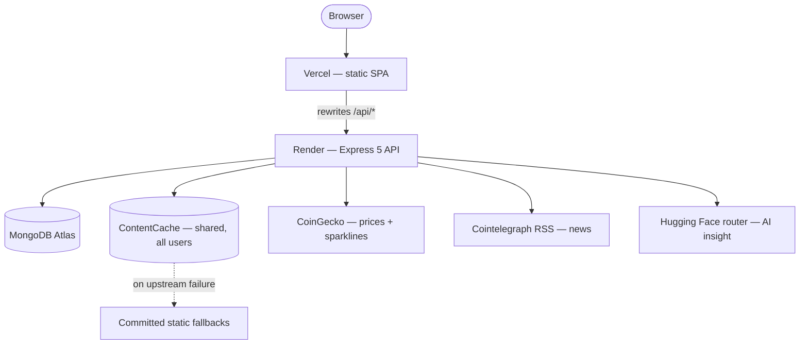

# 🪙 AI Crypto Advisor

[](package.json)
[](package-lock.json)
[](apps/web/package.json)
[](apps/api/package.json)
[](apps/api/src/lib/db.ts)
[](packages/shared/src/index.ts)
[](apps/api/src/tests)
[](.github/workflows/ci.yml)

A personalised crypto dashboard, built as an npm workspaces monorepo in TypeScript end to end.

A user signs up, answers a short onboarding quiz, and lands on a dashboard whose four sections
— news, prices, an AI insight and a meme — are composed server-side from their stated
preferences. Every section can be voted on, and each vote is stored with a frozen snapshot of
the preferences that produced the item, so the votes are usable as training data rather than
just counters. The feature list is small on purpose: the engineering worth reading is in what
the dashboard does when CoinGecko rate-limits or Hugging Face cold-starts.

**Live:** [ai-crypto-advisor-yarins0.vercel.app](https://ai-crypto-advisor-yarins0.vercel.app)
· **How it works:** [`docs/ARCHITECTURE.md`](docs/ARCHITECTURE.md)
· **Why it works that way:** [`docs/PLAN.md`](docs/PLAN.md)

## 📑 Table of Contents

- [🏗️ Architecture](#-architecture)
- [🛡️ How it degrades](#-how-it-degrades)
- [💻 Local development](#-local-development)
- [🔑 Environment variables](#-environment-variables)
- [🔌 API surface](#-api-surface)
- [🧪 Scripts](#-scripts)
- [👀 Reviewer access](#-reviewer-access)
- [📁 Repo layout](#-repo-layout)

## 🏗️ Architecture



- **Vercel** (`vercel.json`) serves the built SPA and rewrites `/api/:path*` to Render. This is
  the load-bearing piece of the whole design: one origin means the refresh cookie is
  first-party and can use `SameSite=Lax`, which blocks CSRF without any token machinery. The
  rewrite must precede the SPA fallback, or API calls resolve to `index.html`.
- **Express 5 API** (`apps/api/src/app.ts`) mounts four routers behind `requireAuth`, with
  `requireOnboarded` gating the two that need a preference document. `GET /api/dashboard`
  composes every selected section server-side, so the client makes one round trip and never
  learns which third-party APIs exist.
- **MongoDB Atlas** (`apps/api/src/lib/db.ts`) holds users, preferences, votes, refresh tokens
  and the content cache. Frankfurt, matching the Render region.
- **ContentCache** is keyed per resource, not per user — one CoinGecko call serves everyone.
  A TTL index purges rows after 7 days, far past any logical TTL, because the stale tier serves
  already-expired rows and freshness is computed in code rather than stored.
- **Static fallbacks** (`apps/api/src/integrations/fallbacks/`) are committed data, served when
  both the live fetch and the stale cache have nothing.
- **CoinGecko, Cointelegraph, Hugging Face** are the three upstreams. Memes have no upstream —
  the curated list is the source, not a fallback. Reddit is deliberately not called: it blocks
  datacenter IPs, so an opportunistic branch would never succeed in production.

## 🛡️ How it degrades

Every free API in this project will fail during a review. Each integration goes through one
helper with a three-tier path:

```
live fetch  →  stale cache (serve expired data rather than nothing)  →  committed fallback
```

Every dashboard section carries `source: 'live' | 'cache' | 'fallback'` and `fetchedAt`, and
the UI shows a small badge when data is not live. `source` names which tier answered, not where
the bytes came from — a cache hit inside its TTL reports `live`, so the badge means something
when it does appear.

Per-integration TTLs, fallbacks and the reasoning behind each are in
[`docs/PLAN.md` §6](docs/PLAN.md).

## 💻 Local development

**Prerequisites:** Node `24.x` (the version is pinned in `engines`, and CI, Render and Vercel
all run the same major), and a MongoDB connection string — Atlas free tier or a local `mongod`.

1. Install from the repository root. The root install is what creates the `@aca/shared`
   workspace symlink and runs its `prepare` build, so both apps resolve it:

   ```bash
   npm install
   ```

2. Create the API environment file. Every variable is listed with a comment linking to where
   its value comes from:

   ```bash
   cp apps/api/.env.example apps/api/.env
   ```

   The web app needs no environment file — `vite.config.ts` proxies `/api` to
   `http://localhost:4000`, which reproduces the production Vercel rewrite so cookie and CORS
   behaviour cannot differ between development and the deployment.

3. Fill in `apps/api/.env`. `MONGODB_URI`, `JWT_ACCESS_SECRET` and `REFRESH_TOKEN_PEPPER` are
   required and the process refuses to boot without them; see
   [Environment variables](#-environment-variables).

4. Start both apps:

   ```bash
   npm run dev
   ```

5. Confirm the API answers:

   ```bash
   curl http://localhost:4000/api/health
   ```

The web app runs on <http://localhost:5173>, the API on <http://localhost:4000>.

**Tests:** `npm test` — Vitest across every workspace. The API suite runs against an in-memory
MongoDB, so no connection string is needed to run it.

## 🔑 Environment variables

Validated once at boot by [`apps/api/src/env.ts`](apps/api/src/env.ts), so a missing secret
fails loudly on start rather than silently at the first request that needs it. Unknown keys are
stripped: adding a variable to `render.yaml` without adding it here does nothing.

| Variable                 | Required | Default                            | Notes                                                                   |
| ------------------------ | -------- | ---------------------------------- | ----------------------------------------------------------------------- |
| `MONGODB_URI`            | yes      | —                                  | Atlas or local `mongod`.                                                |
| `JWT_ACCESS_SECRET`      | yes      | —                                  | Min 32 chars; a short secret is brute-forceable offline.                |
| `REFRESH_TOKEN_PEPPER`   | yes      | —                                  | Min 32 chars. Mixed into every refresh-token hash before storage.       |
| `NODE_ENV`               | no       | `development`                      | Derives the refresh cookie's `secure` flag.                             |
| `PORT`                   | no       | `4000`                             |                                                                         |
| `WEB_ORIGIN`             | no       | `http://localhost:5173`            | CORS allowlist. No trailing slash — compared to `Origin` verbatim.      |
| `ACCESS_TOKEN_TTL`       | no       | `15m`                              | A `jsonwebtoken` duration string.                                       |
| `REFRESH_TOKEN_TTL_DAYS` | no       | `30`                               |                                                                         |
| `HF_TOKEN`               | no       | —                                  | Absent means the AI insight always serves its deterministic fallback.   |
| `HF_MODEL`               | no       | `meta-llama/Llama-3.1-8B-Instruct` | Configurable because free-tier model ids are deprecated without notice. |
| `HF_BASE_URL`            | no       | `https://router.huggingface.co/v1` | OpenAI-compatible chat completions.                                     |

## 🔌 API surface

```
POST   /api/auth/register        201 { user, accessToken } + refresh cookie
POST   /api/auth/login           200 { user, accessToken } + refresh cookie
POST   /api/auth/refresh         200 rotated cookie
POST   /api/auth/logout          204
GET    /api/auth/me              200 PublicUser

GET    /api/onboarding/questions server-driven quiz; the client renders it, never hardcodes it
GET    /api/preferences
PUT    /api/preferences          onboarding submit and later edits share one endpoint

GET    /api/dashboard            every selected section, composed in one round trip
GET    /api/dashboard/meme       re-roll the meme only
POST   /api/votes                upsert; value 0 clears
GET    /api/votes                the caller's own votes
GET    /api/votes/summary        aggregate counts

GET    /api/health
```

The access token is returned in the body only, never as a cookie. The refresh token is the
opposite: an httpOnly cookie on `Path=/api/auth`, never in a body. Every error uses one shape,
`{ error, fields? }`, where `fields` is filled by Zod validation failures and nothing else.

Request and response payloads are Zod schemas in [`packages/shared`](packages/shared/src),
imported by both apps — the client parses every response against the same schema the server
validated against, so the contract cannot drift. Full payloads and status codes are in
[`docs/PLAN.md` §5](docs/PLAN.md).

## 🧪 Scripts

Run from the repository root.

| Command                      | Effect                                              |
| ---------------------------- | --------------------------------------------------- |
| `npm run dev`                | Start the API and the web app together              |
| `npm run build`              | Build every workspace, shared package first         |
| `npm test`                   | Vitest across every workspace                       |
| `npm run typecheck`          | TypeScript across every workspace                   |
| `npm run lint`               | ESLint over the repository                          |
| `npm run format:check`       | Prettier, check only                                |
| `npm run smoke`              | Drive a **running** server end to end over HTTP     |
| `npm run check:integrations` | Verify the four upstreams against the real internet |

The first five run in CI. The last two do not, deliberately: both need external state a runner
does not have — a live server, real upstreams, Hugging Face credentials. `smoke` accepts
`BASE_URL=https://<host>` to run against a deployment, and cleans up the throwaway user it
creates.

## 👀 Reviewer access

**There is no demo account — please register your own.** Signup, onboarding and the first vote
are the flow being graded, so walking them shows the product rather than its residue. It takes
about a minute.

One consequence worth stating: the vote summary and the `Vote.context` training snapshot are
empty until you vote. Cast a vote on any section, then look at `GET /api/votes/summary` and at
the `votes` collection to see the frozen preference snapshot each vote records.

Read-only MongoDB Atlas credentials are in the submission email, not in this repository —
credentials committed to a public repo are found by scrapers within hours, and Atlas may
disable the user mid-review.

**The API sleeps.** Render's free tier idles the service after 15 minutes, so the first request
after a quiet period takes roughly 50 seconds while it wakes. The UI shows a loading state
rather than an error; a second load is fast.

## 📁 Repo layout

```
apps/
  web/                    React 19 + Vite SPA                       → Vercel
    src/app/              router, providers, route guards
    src/features/         auth · onboarding · preferences · dashboard · votes
    src/components/       ui primitives (Card, Button, TextField, question inputs)
    src/lib/              api client, query client, formatters
  api/                    Express 5 + TypeScript                    → Render
    src/modules/          auth · preferences · dashboard · votes (route · service · model)
    src/integrations/     coingecko · cointelegraph · huggingface · memes + static fallbacks
    src/middleware/       requireAuth · requireOnboarded · validateBody · errorHandler
    src/lib/              cache, http client, db connection, error types
packages/shared/          Zod schemas and inferred types, imported by both apps
scripts/                  smoke.mjs · check-integrations.mjs
docs/ARCHITECTURE.md      how the system works: topology, request path, flows
docs/PLAN.md              why it works that way: data model, API contract, decisions
render.yaml               API service blueprint
vercel.json               SPA build and the /api rewrite
```

Both deploy platforms build from the **repository root**, never from a workspace directory:
`@aca/shared` resolves only through the symlink a root install creates, and a Vercel project
rooted at `apps/web` would never see `vercel.json` at all.
