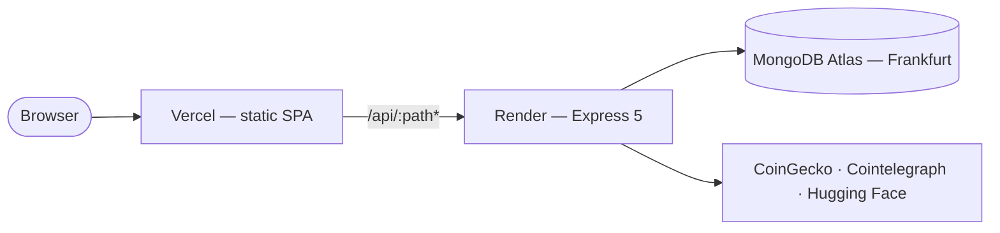
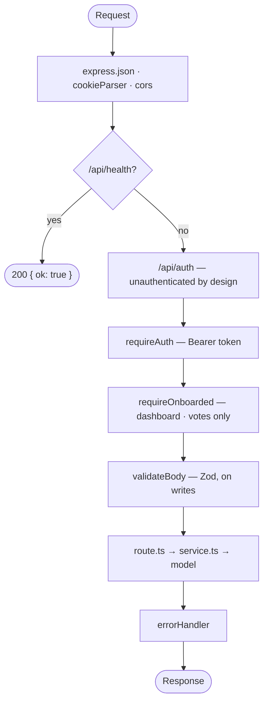
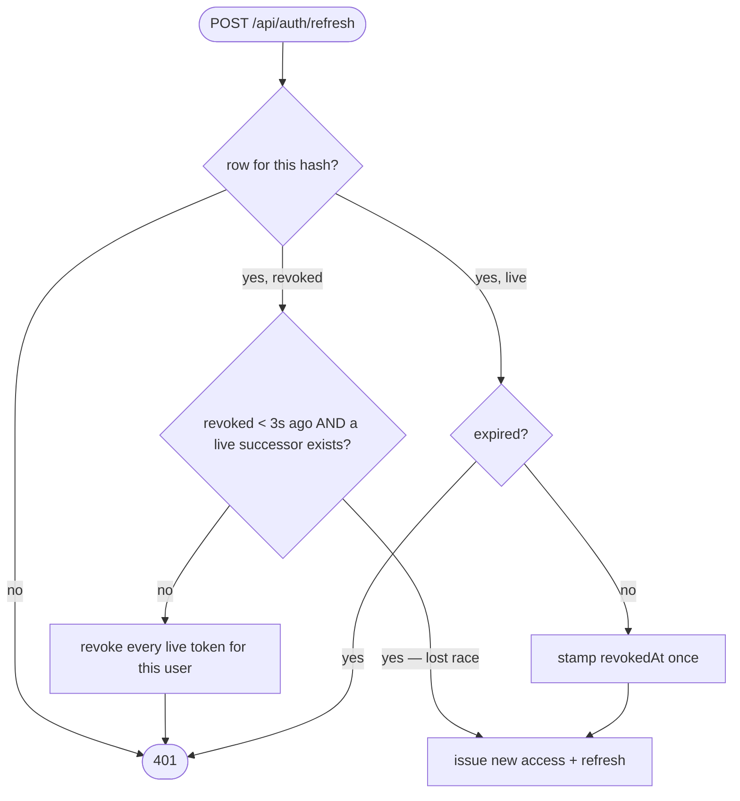
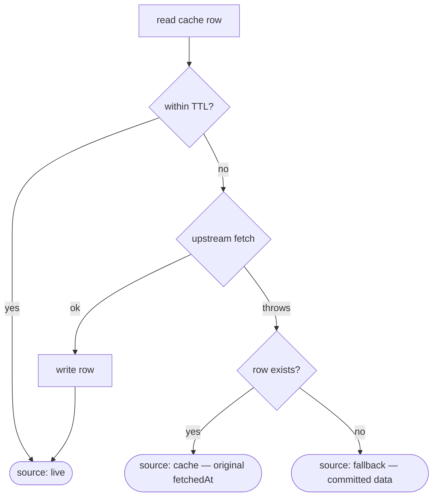

# Architecture

How the system works as it stands. [`PLAN.md`](PLAN.md) is the decision record — it says why
each choice was made, and keeps the reversals that got there. This document does not repeat
that reasoning; where a "why" matters here it links to the section that owns it.

- [Runtime topology](#runtime-topology)
- [The request path](#the-request-path)
- [Errors: one shape, one place](#errors-one-shape-one-place)
- [Session lifecycle](#session-lifecycle)
- [Dashboard composition](#dashboard-composition)
- [Degradation: one helper, three tiers](#degradation-one-helper-three-tiers)
- [Votes and the training payload](#votes-and-the-training-payload)
- [Where state lives](#where-state-lives)
- [Module boundaries](#module-boundaries)
- [Frontend structure](#frontend-structure)

## Runtime topology

Three deployed pieces, one browser origin.



The browser only ever talks to the Vercel origin. `vercel.json` rewrites `/api/:path*` to the
Render service and everything else to `index.html`; the API rewrite must come first, or every
API call resolves to the SPA shell and surfaces as a JSON parse error rather than a 404.

One origin is what makes the refresh cookie first-party, which is what allows `SameSite=Lax`
and removes the need for CSRF tokens ([`PLAN.md` §9](PLAN.md)). Development reproduces the same
topology: `vite.config.ts` proxies `/api` to `localhost:4000`, so cookie and CORS behaviour
cannot differ between a developer's machine and production. CORS remains configured for a
direct `localhost:4000` call, but is not load-bearing in the deployment.

`apps/api/src/env.ts` validates the entire environment once at boot and `server.ts` opens the
database connection before the listener binds. Both are deliberate: a missing secret or a bad
connection string stops the process with one readable message instead of turning every request
into a 500. Render's health check hits `/api/health`, so a boot that fails validation is
reported as a failed deploy rather than a live service returning errors.

## The request path

Middleware order in `app.ts` is the API's access-control policy, expressed once:



Guards are mounted on the router group, not per route. `preferencesRouter` sits behind
`requireAuth` alone — a user must reach preferences precisely because they have not onboarded
yet — while `dashboardRouter` and `votesRouter` sit behind `requireAuth` **and**
`requireOnboarded`. Mounting at the group means a route added to either router later cannot
accidentally be published without its guard.

The two guards fail differently on purpose. `requireAuth` returns 401 for a missing, expired,
malformed or badly signed token, collapsing all four into one message so the client learns
nothing about which. `requireOnboarded` returns **403**: the caller is authenticated, just not
yet eligible, which is what lets the web app route them to the onboarding wizard rather than
back to the login screen.

`requireOnboarded` re-checks `req.userId` even though `requireAuth` set it. That is not
redundancy — Mongoose strips `undefined` from a query, so an absent id would widen
`exists({ _id: undefined, onboardedAt: { $ne: null } })` into "does any onboarded user exist",
and the guard would pass for an unauthenticated caller.

`validateBody(schema)` parses `req.body` and **replaces it with the parsed value**, so handlers
downstream receive coerced, trusted data and never the raw payload. Failures are forwarded to
`next` as a `ZodError`; the middleware itself writes no response.

## Errors: one shape, one place

No route builds an error response. Every handler throws or calls `next`, and `errorHandler`
— mounted last, because Express reaches an error handler only after every route above has
declined — maps the error to the single wire shape `{ error, fields? }`.

| Thrown                           | Status | Body                                          |
| -------------------------------- | ------ | --------------------------------------------- |
| `ZodError` (from `validateBody`) | 400    | `{ error: 'Validation failed', fields: {…} }` |
| `HttpError(status, message)`     | as set | `{ error: message }`                          |
| Mongo duplicate key (`11000`)    | 409    | `{ error: 'Already exists' }`                 |
| Anything else                    | 500    | `{ error: 'Internal server error' }`, logged  |

`fields` is filled by Zod validation failures and by nothing else, which is what lets the web
app map it straight onto form fields without guessing.

The 500 branch logs the raw error and sends a generic message. Upstream errors carry query
fragments, file paths and library versions; none of that reaches a client.

The duplicate-key branch is load-bearing rather than defensive. `registerUser` deliberately does
**not** pre-check whether an email exists — a read-then-write leaves a race window — so the
unique index is the check, and this branch is what turns it into a 409.

## Session lifecycle

Two tokens with opposite properties, deliberately.

|                | Access token                       | Refresh token                              |
| -------------- | ---------------------------------- | ------------------------------------------ |
| Form           | JWT, subject only, no other claims | 48 random bytes, base64url — not a JWT     |
| Transport      | response body only                 | httpOnly cookie, `Path=/api/auth` only     |
| Client storage | memory (`lib/api/session.ts`)      | never readable by page JavaScript          |
| Lifetime       | `ACCESS_TOKEN_TTL`, default 15m    | `REFRESH_TOKEN_TTL_DAYS`, default 30       |
| Server state   | none — verified by signature       | one row per token, HMAC-hashed with pepper |

The refresh token is not a JWT because it is looked up on every use anyway; being stored is what
makes it individually revocable, which logout and theft response both require. It is stored as
`HMAC-SHA256(token, REFRESH_TOKEN_PEPPER)` rather than plain SHA-256 — the pepper never leaves
the server, so the read-only database access handed to a reviewer cannot match a captured token
to its row.

`loginUser` compares against a dummy bcrypt hash when no user matches, so an unknown email and a
wrong password fail identically in both message and timing and neither enumerates registered
addresses.

### Rotation, and telling a replay from a race



Replaying an already-revoked token is read as theft, and the response is to revoke the user's
whole family — logging out thief and owner alike. The exception is the far likelier case of a
lost rotation race: two tabs booting on one cookie. Both conditions of that exception are
load-bearing. Liveness alone would forgive a replay days later while the owner's session runs;
the three-second interval alone would forgive tokens that a logout or a family revocation just
stamped, since those are revoked "recently" too.

`revokedAt` is stamped once and never re-stamped, so the grace window is anchored to the first
revocation. Re-stamping on each replay would slide the window forward and keep a stolen token
valid indefinitely.

### The client half

`apps/web/src/lib/api/client.ts` holds the access token in memory and attaches it as
`Authorization: Bearer`. On a 401 for a request that _carried_ a token, it refreshes once and
retries; a 401 on a request that carried none is the endpoint's own verdict and is surfaced
unchanged, since refreshing cannot repair it and would discard its message.

Concurrent 401s share one in-flight refresh promise, so the endpoint is hit exactly once. The
API's reuse interval would already keep a parallel refresh from revoking the session, but the
loser of that race still burns a rotation and strands a token nothing holds.

Every response is parsed against the shared Zod schema before it reaches a component, which
turns a backend contract change into a loud failure at the boundary rather than an `undefined`
surfacing three layers deep.

## Dashboard composition

`GET /api/dashboard` returns every selected section in one round trip, and the client never
learns which third-party APIs exist. The order inside `buildDashboard` is not uniform fan-out:

1. Load the preference document; 403 if absent.
2. If **either** `prices` or `insight` is selected, fetch coin markets **once** — the market
   data feeds both the price cards and the insight prompt, so fanning out would fetch it twice.
3. Filter the markets response to the user's selected assets.
4. Compose news and the insight **in parallel**; the insight needs the coins from step 2.
5. Pick a meme synchronously — it has no upstream.

All four section keys are always present in the response, and a deselected section is `null`
rather than omitted. Optional keys would make a section dropped by a bug indistinguishable on
the wire from one deliberately deselected, and the client parses this response against the
shared schema precisely so it can prove the response is complete.

`prices` is gated on the preference rather than on the presence of market data, because step 2
fetches markets for an insight-only user too.

News merges one feed per selected asset: deduplicate by id, sort newest first, cap at 12. The
merged section reports the **worst** tier any contributing feed returned and the **oldest** of
their fetch times, so the staleness badge can never overstate freshness. A merged feed that
comes back empty is replaced with the committed fallback at this layer, not in the integration
— a feed returning zero articles is a genuinely successful fetch, and caching canned data as if
it were live would poison the cache.

## Degradation: one helper, three tiers

Every integration goes through `getCachedContent` in `lib/cache.ts`. Nothing else decides what
to serve when an upstream fails.



Four properties of this helper carry weight:

- **The row is read before the fetch is attempted**, not after it fails, because the stale tier
  needs it even on a miss that was expected.
- **`source` names which tier answered, not where the bytes came from.** A cache hit inside its
  TTL reports `live`. Reporting every hit as `cache` would light the staleness badge on almost
  every render and stop conveying anything.
- **The stale tier carries the row's original `fetchedAt`**, never `now`, so the UI can report
  how old the data actually is. The fallback tier is dated `now` instead — a committed date
  would render as months old and read as broken rather than degraded.
- **A cache write failure never fails a request** whose data was already fetched successfully.

Options are named rather than positional because `fetcher` and `fallback` are both nullary
callables: a positional swap would typecheck and silently promote canned data to the primary
source.

Cache keys carry a version segment (`coingecko:v1:markets`). A deploy that changes a payload's
shape bumps the version instead of migrating rows, which is what makes the helper's cast sound
— a row written under `:v1` is never read by code expecting `:v2`.

There is no stampede lock. Concurrent misses cost a few redundant upstream calls, and the worst
outcome — a rate limit — is exactly what the tiers below absorb.

Below the helper, `lib/http.ts` adds an 8-second timeout and a `User-Agent`, and throws a plain
`Error` on any non-2xx. Never an `HttpError`: an upstream 429 must not become the status this
API returns to its own client. It also does not retry, because the helper's degradation path is
what turns a throw into a served response.

The AI insight is the one section that skips the stale tier. Its key is scoped per user per UTC
day, which puts yesterday's row permanently out of reach — yesterday's prose about yesterday's
prices is a worse answer than today's deterministic template about today's.

## Votes and the training payload

A vote is not a counter. Each one freezes the context that produced the item, because the point
is a usable training row ([`PLAN.md` §10](PLAN.md)). Three rules protect that payload:

- **Context is built server-side from the preference document and the resolved item.**
  `buildVoteContext` takes no request-derived parameter at all, so there is no path through
  which a client could reach it. A client-supplied `itemMeta` would let anyone inject fabricated
  training rows.
- **An item must be one the caller's own preferences could have served.** `resolveVotedItem`
  checks section membership and, for coins, asset membership. A label recorded against content
  the user never saw is worse than no label.
- **The served preference version is echoed and compared.** The dashboard response carries the
  `preferenceVersion` it composed under, the vote request sends it back, and a mismatch is
  rejected with 409 rather than recorded against the wrong version. The echoed value is compared
  and then discarded.

Clearing a vote (`value: 0`) deliberately skips both the version check and item resolution: it
writes no context, so it must keep working for a user whose preferences moved on, or whose item
has aged out of cache.

The insight is authenticated by user plus UTC day rather than by a cache row, because the
templated fallback is served without writing one — an absent row is routine, not forgery. The
row, when present, only enriches the recorded metadata.

A unique index on `(userId, section, itemId)` makes re-voting an update, never a duplicate.

## Where state lives

| Collection      | Holds                                 | Index that matters                            |
| --------------- | ------------------------------------- | --------------------------------------------- |
| `users`         | credentials, `onboardedAt`            | unique `email` — also the register race check |
| `preferences`   | one per user, with `version`          | unique `userId`                               |
| `votes`         | value plus the frozen context         | unique `(userId, section, itemId)`            |
| `refreshtokens` | `tokenHash`, `expiresAt`, `revokedAt` | looked up by hash on every refresh            |
| `contentcaches` | shared upstream payloads              | unique `key`; TTL on `fetchedAt`, 7 days      |

The content cache is keyed per resource, never per user — one CoinGecko call serves everyone,
which is the rate-limit mitigation the whole design depends on. The 7-day TTL is far past any
caller's freshness window on purpose: the stale tier serves already-expired rows, so a reaper
tied to freshness would delete exactly what that tier exists to return. Freshness is computed in
code and never stored.

`connectDatabase` calls `model.init()` on every model at boot. Mongoose builds indexes in the
background, so without it a write can land on a fresh database before the unique index exists
and a duplicate email would be accepted.

## Module boundaries

The API is organised by feature, not by layer. Every module has the same two entry files, plus
a Mongoose schema where it owns persistent state:

```
modules/<feature>/
  route.ts      HTTP only — reads the request, calls a service, sets the status
  service.ts    the feature's logic; throws HttpError, never touches req or res
  *.model.ts    the Mongoose schema, where the module owns one
```

The shape varies where the feature does, and that variation is informative rather than
untidy: `auth/` carries two schemas (`user.model.ts`, `refresh-token.model.ts`) because a
session is a separate revocable object from the account, and `dashboard/` carries none at all
because it owns no state — it composes other modules' data and caches through the shared
helper.

Routes never query the database and services never see `req` or `res`. That is what lets the
test suite drive services directly and lets `smoke.mjs` drive the routes over real HTTP, without
either duplicating the other.

Two directories exist to keep that boundary honest:

- `integrations/` is the only place that knows a third-party API exists. A service asks for
  "news for these assets" and receives an envelope with a tier and a timestamp; it cannot tell
  whether the bytes came from Cointelegraph or from a committed file.
- `middleware/` holds every cross-cutting concern — the two guards, body validation, the error
  handler. A module that needed its own variant of one of these would be a design smell.

`packages/shared` holds the Zod schemas and the types inferred from them, imported by both apps.
The server validates against them and the client parses against them, so the API contract has
exactly one definition. It compiles to `dist/` via a `prepare` script, and the root `workspaces`
array lists `packages/*` before `apps/*` so a root build produces it before anything consumes it.

## Frontend structure

```
src/app/          router, providers, route guards
src/features/     auth · onboarding · preferences · dashboard · votes
src/components/   presentational primitives, no data fetching
src/lib/          api client, query client, formatters
```

A feature owns its screens, its `api.ts`, and its hooks. Components in `src/components/` take
props and render; they never fetch, which is what keeps them reusable across features and
trivially testable.

Server state lives in TanStack Query, never in component state — the cache is the single source
of truth for anything the API owns, so two components showing the same data cannot disagree.
Votes are applied optimistically and rolled back on failure.

Recharts is loaded lazily and is the one deliberate structural exception. `Sparkline` is an eager
wrapper that owns the sized box, the colour and the minimum-length guard; `SparklineChart` is
lazily imported and is the only module that touches Recharts. Keeping the box eager holds the
coin row's layout while the chunk loads, and keeping the guard eager means a coin with too short
a series never requests the chunk at all. The measurements behind this are in
[`PLAN.md` §2](PLAN.md).
